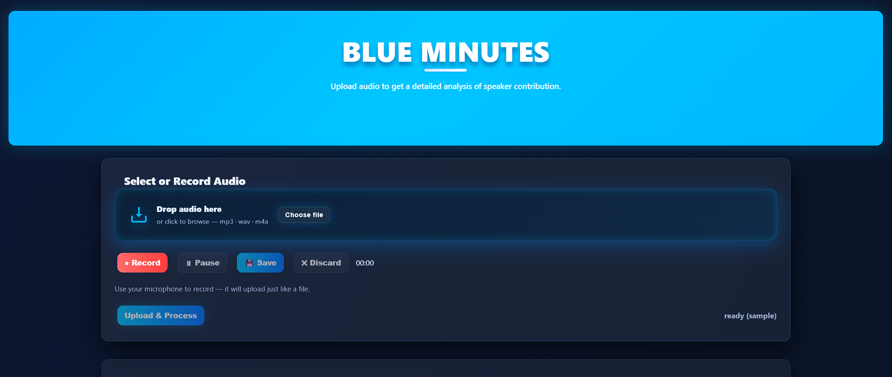
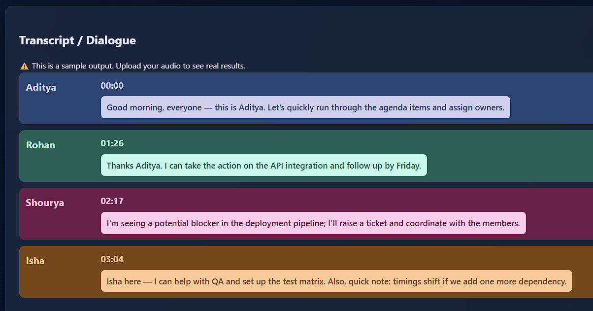
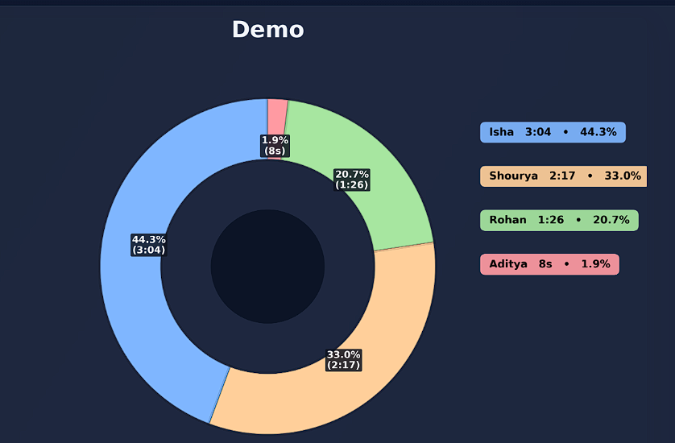
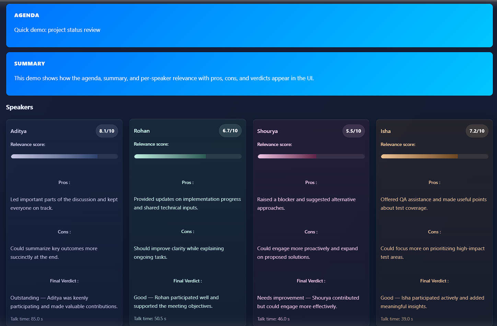

# 🎙️ Meeting Analyzer

Turn a meeting audio recording into a **speaker-attributed transcript**, a **summary with key decisions and action items**, per-speaker **contribution analytics**, and a **talk-time chart** — all in the browser.

Upload an audio file (or record from your mic), and the app runs a full pipeline:
**diarization → transcription → speaker-name mapping → talk-time visualization → LLM analysis.**

---

## 📸 Screenshots

### Main page — upload or record
<p align="center">
  
</p>

### Speaker-attributed transcript
<p align="center">
  
</p>

### Talk-time breakdown & LLM analysis
<p align="center">
  
  
</p>

---

## ✨ Features

- **Speaker diarization** — detects *who spoke when* (pyannote).
- **Automatic speech recognition** — transcribes each speaker turn (faster-whisper).
- **Speaker name mapping** — infers real names from self-introductions ("this is Aditya", "Rohan here").
- **LLM meeting analysis** (OpenAI) — produces:
  - Agenda + concise summary
  - **Key decisions**
  - **Action items** (task · owner · due)
  - Per-speaker relevance score, pros, cons, and a verdict
- **Talk-time donut chart** of each speaker's contribution.
- **Web UI** — drag-and-drop upload *or* in-browser recording, live progress, and a rich results view.

---

## 🏗️ Architecture

Two cooperating servers:

```
Browser (static/)  ──►  Flask frontend (app.py, :7860)  ──►  FastAPI worker (worker_server.py, :9000)
    UI + recorder            thin proxy / static host              heavy ML pipeline + job queue
```

- **`app.py`** — serves the frontend and proxies upload/status/result calls to the worker.
- **`worker_server.py`** — preloads the models, runs the pipeline in a background thread, and exposes a job API (`/process`, `/status/{id}`, `/result/{id}`).

### Pipeline stages

| Stage | Module | Model | Output |
|-------|--------|-------|--------|
| 1. Diarization | `dia.py` | `pyannote/speaker-diarization-3.1` | `<stem>_diar_merged.json`, `<stem>_speaking_durations.json` |
| 2. ASR + name mapping | `asr.py` | faster-whisper | `<stem>_dialogue_named.json`, `<stem>_name_map.json` |
| 3. Visualization | `visualize.py` | matplotlib | `<stem>_pie.png` |
| 4. LLM analysis | `rag.py` | OpenAI `gpt-4o-mini` | `<stem>_analysis.json` |

All artifacts are written to `results/`.

---

## 🚀 Getting Started

### 1. Prerequisites

- **Python 3.11**
- **ffmpeg** on your `PATH` (used to cut/transcode audio)
  - Windows: `winget install Gyan.FFmpeg` · macOS: `brew install ffmpeg` · Linux: `apt install ffmpeg`
- Two API credentials (both free to obtain):
  - **HuggingFace token** for pyannote — create at <https://huggingface.co/settings/tokens>, then accept the terms on the [model page](https://huggingface.co/pyannote/speaker-diarization-3.1).
  - **OpenAI API key** — <https://platform.openai.com/api-keys>

### 2. Install

```bash
python -m venv .venv
# Windows:
.venv\Scripts\activate
# macOS/Linux:
source .venv/bin/activate

pip install -r requirements.txt
```

> **GPU note:** `requirements.txt` pins CPU-friendly versions of `torch`/`torchaudio`. For CUDA, install the matching build from <https://pytorch.org> first, then run the install above.

### 3. Configure secrets

```bash
cp .env.example .env
```

Edit `.env` and fill in `HF_TOKEN` and `OPENAI_API_KEY`. (`.env` is git-ignored.)

### 4. Run

**Windows (one click):**
```bat
run_worker.bat
```
This activates the venv, starts the worker and the frontend in separate windows, and opens the browser.

**Manual (any OS), two terminals:**
```bash
# Terminal 1 — worker
python -m uvicorn worker_server:app --host 0.0.0.0 --port 9000

# Terminal 2 — frontend
python app.py
```

Then open <http://127.0.0.1:7860>.

---

## 📖 Usage

1. Open the app and **upload** an audio file (`.wav`, `.mp3`, `.m4a`, `.opus`, …) or **record** from your microphone.
2. Click **Upload & Process** and watch the progress bar.
3. When done you'll see:
   - the **transcript** with color-coded speakers,
   - the **talk-time donut chart**,
   - the **analysis card**: agenda, summary, key decisions, action items, and per-speaker scoring.

Sample audio files are included in `audio/` (`sample_meeting_1..4.wav`) to try it out.

---

## 🧩 LLM prompt

`rag.py` sends the diarized transcript to the model and asks it to return strict JSON with the
agenda, summary, `key_decisions`, `action_items` (`task` / `owner` / `due`), and per-speaker
scoring. Responses are validated and normalized before being written to `<stem>_analysis.json`,
so malformed model output degrades gracefully instead of breaking the UI.

---

## ⚙️ Configuration

All optional settings live in `.env` (see `.env.example`):

| Variable | Default | Purpose |
|----------|---------|---------|
| `HF_TOKEN` | — | HuggingFace token (diarization) — **required** |
| `OPENAI_API_KEY` | — | OpenAI key (analysis) — **required** |
| `WORKER_DEVICE` | `cpu` | `cpu` or `cuda` |
| `WHISPER_MODEL` | `small` | whisper size (`tiny`…`large-v3`) |
| `WHISPER_COMPUTE_TYPE` | `int8` | compute precision |
| `WORKER_URL` | `http://127.0.0.1:9000` | worker address used by the frontend |
| `FLASK_PORT` | `7860` | frontend port |

---

## 📂 Project layout

```
app.py              Flask frontend / proxy
worker_server.py    FastAPI worker + job queue (pipeline orchestrator)
dia.py              Diarization (pyannote)
asr.py              ASR + speaker-name mapping (faster-whisper)
visualize.py        Talk-time donut chart
rag.py              LLM analysis (summary, decisions, action items, scoring)
static/             Frontend (index.html, script.js, style.css)
audio/              Input audio (sample files included)
results/            Generated artifacts (git-ignored)
run_worker.bat      Windows launcher
```

---

## 🔒 Notes & limitations

- First run downloads the pyannote and whisper model weights (may take a while).
- CPU transcription of long meetings is slow; use a smaller `WHISPER_MODEL` or a GPU for speed.
- Name mapping is heuristic and only resolves names that speakers actually say out loud;
  otherwise speakers stay labeled `SPEAKER_00`, etc.
